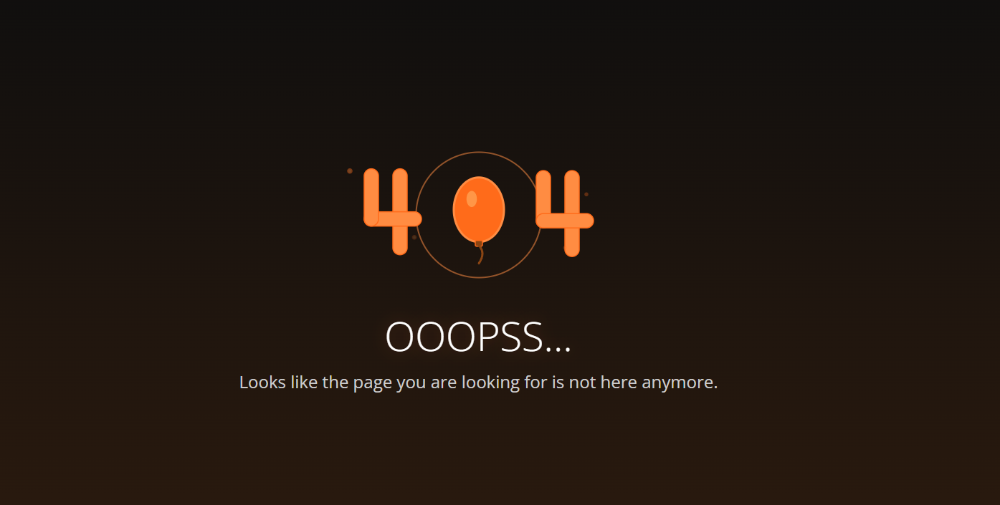

# Custom Default Backend for NGINX Ingress Controller

A lightweight, customizable default backend service for NGINX Ingress Controller in Kubernetes clusters. This Docker image provides a simple NGINX server that handles various HTTP status codes with custom error pages, perfect for improving user experience when services are unavailable or return errors.

<p align="center">
  <a href="https://hub.docker.com/repository/docker/kalmars/ingress-default-backend" alt="Docker Version">
    
  </a>
  <a href="https://hub.docker.com/repository/docker/kalmars/ingress-default-backend" alt="Docker Pulls">
    
  </a>
  <a href="https://hub.docker.com/repository/docker/kalmars/ingress-default-backend" alt="Docker Image size">
    
  </a>
  <a href="LICENSE" alt="GitHub License">
    
  </a>
</p>

## Overview

This project provides a production-ready default backend service for NGINX Ingress Controller deployments. When your Kubernetes services are unavailable or return errors, this backend serves custom error pages instead of generic NGINX error messages.

### Key Features

- **Lightweight**: Minimal Docker image based on NGINX Alpine
- **Customizable**: Easy to modify HTML templates and styling
- **Status Code Support**: Handles 400, 401, 403, 404, 500, 502, 503, and 504 status codes
- **Production Ready**: Optimized for Kubernetes environments
- **Easy Integration**: Simple Helm chart configuration

### Image Examples

Here's an example of how the custom 404 error page looks:



*Custom 404 error page with modern design and user-friendly messaging*

## Quick Start

### Installation via Helm

The easiest way to deploy this default backend is using the official [ingress-nginx](https://github.com/kubernetes/ingress-nginx/tree/main/charts/ingress-nginx) Helm chart. Simply configure the `defaultBackend` property in your values file:

```yaml
defaultBackend:
  enabled: true
  image:
    repository: kalmars/ingress-default-backend
    tag: "main"
    pullPolicy: Always
  port: 8080
```

### Manual Deployment

If you prefer to deploy manually, you can create a Kubernetes deployment:

```yaml
apiVersion: apps/v1
kind: Deployment
metadata:
  name: default-backend
spec:
  replicas: 1
  selector:
    matchLabels:
      app: default-backend
  template:
    metadata:
      labels:
        app: default-backend
    spec:
      containers:
      - name: default-backend
        image: kalmars/ingress-default-backend:main
        ports:
        - containerPort: 8080
---
apiVersion: v1
kind: Service
metadata:
  name: default-backend
spec:
  selector:
    app: default-backend
  ports:
  - port: 80
    targetPort: 8080
```

## Customization

### Basic HTML Customization

To customize the error pages, fork this repository and modify the HTML files in the `content/` directory. You can update:

- **CSS styling** for better visual appearance
- **Text content** and messaging
- **Branding** and logos
- **Color schemes** and layouts

### Advanced: Per-Status-Code Pages

For more granular control, you can create separate HTML files for each status code. This allows you to have different error pages for 404, 500, 503, etc.

1. Create individual HTML files in the `content/` directory (e.g., `404.html`, `500.html`)
2. Update the NGINX configuration to serve these specific files:

```nginx
# etc/nginx/conf.d/default.conf

server {
    listen 8080;
    server_name _;
    
    # Custom error pages for different status codes
    error_page 400 /400.html;
    error_page 401 /401.html;
    error_page 403 /403.html;
    error_page 404 /404.html;
    error_page 500 /500.html;
    error_page 502 /502.html;
    error_page 503 /503.html;
    error_page 504 /504.html;
    
    # Serve the error pages
    location = /400.html {
        internal;
        root /usr/share/nginx/html;
    }
    
    location = /401.html {
        internal;
        root /usr/share/nginx/html;
    }
    
    # ... repeat for other status codes
}
```

### Building Custom Images

After making your customizations:

1. Build the Docker image:
   ```bash
   docker build -t docker pull kalmars/ingress-default-backend:main .
   ```

2. Push to your container registry:
   ```bash
   docker push docker pull kalmars/ingress-default-backend:main
   ```

3. Update your Helm values or Kubernetes manifests to use your custom image.

## Configuration

### Environment Variables

You can customize the behavior using environment variables:

- `NGINX_WORKER_PROCESSES`: Number of NGINX worker processes (default: auto)
- `NGINX_WORKER_CONNECTIONS`: Maximum number of connections per worker (default: 1024)

### NGINX Configuration

The default NGINX configuration is optimized for Kubernetes environments and includes:

- Gzip compression
- Security headers
- Proper error page handling
- Health check endpoint

## Contributing

We welcome contributions! Please feel free to submit issues and pull requests.

## License

This project is licensed under the MIT License - see the [LICENSE](LICENSE) file for details.

## Support

For support and questions, please open an issue in this repository.
